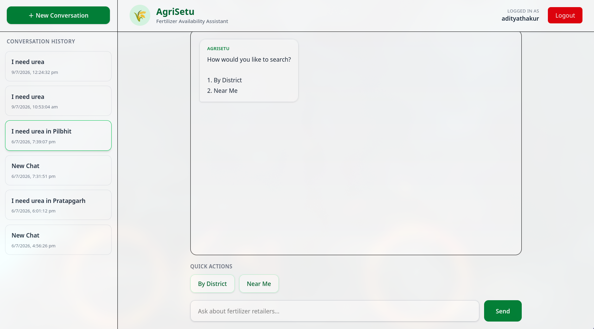
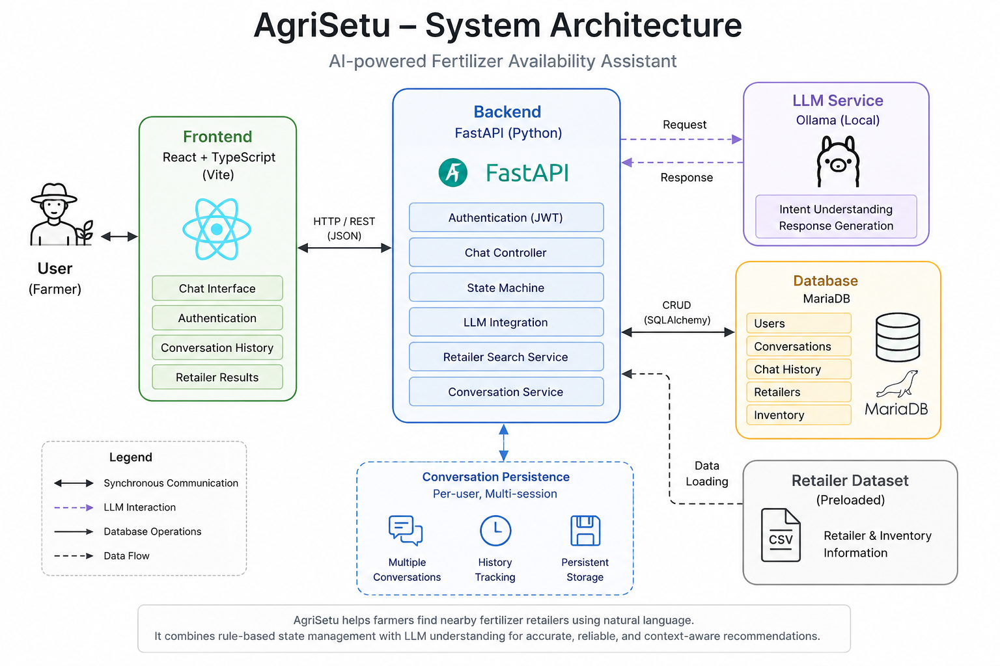

# Agrisetu

A conversational fertilizer retailer search system that helps users locate fertilizer availability through natural language queries.

Agrisetu is a conversational fertilizer availablity chatbot assistant that helps users, particularly in the agriculture industry, locate fertilizer retailers. Instead of manually searching across multiple sources, users can simply describe their requirements, such as the fertilizer they need or the district they are located in, and the system guides them through an interactive conversation to find suitable retailers.

---

The application is built using a React frontend, a FastAPI backend, and a MySQL database. Conversations are managed using a finite state machine to ensure predictable dialogue flow, while a locally hosted Ollama language model is used selectively for intent classification, allowing the chatbot to understand natural language without compromising reliability.

## Demo




## Features

- User authentication with JWT
- Natural language search
- District-based search
- Location-based search
- Conversation history
- Multiple conversations
- Persistent chat sessions
- Retailer availability table
- Local LLM intent classification
- Docker support

## Architecture



## Design Decisions

### 1. State Machine over Fully LLM-driven Conversations

Instead of relying entirely on a large language model for conversation flow, AgriSetu uses a finite state machine to manage user interactions.

This approach provides:

- Predictable conversation flow
- Easier debugging
- Consistent validation of user inputs
- Lower inference cost
- Reduced hallucinations

The language model is used only where natural language understanding adds value, while all business logic remains deterministic.

---

### 2. Local LLM Instead of Cloud APIs

The chatbot uses a locally hosted Ollama model for intent classification instead of relying on external cloud APIs.

Benefits include:

- No dependency on internet connectivity
- Lower operating cost
- Better privacy
- Faster experimentation during development

Since the LLM is only responsible for intent understanding, even lightweight models perform effectively while keeping resource usage low.

### 3. Hybrid NLP Architecture

Natural language processing is separated into two responsibilities:

- **Finite State Machine:** controls conversation flow and business rules.
- **Ollama (Local LLM):** classifies user intent when users provide free-form input.

This hybrid approach combines the flexibility of LLMs with the reliability of rule-based systems.

---

### 4. Persistent Conversations

Instead of treating every chat as a new session, conversations are stored in MySQL.

Each conversation maintains:

- Complete chat history
- Session state
- Current conversation context

This allows users to switch between previous conversations without losing their history.

---

### 5. Session-based Conversation Management

Conversation state is stored independently from the chat messages.

The chatbot remembers:

- Search mode
- Selected district
- Current location
- Search radius
- Selected fertilizer
- Current dialogue state

Keeping session state separate simplifies conversation management and makes the state machine easier to maintain.

---

### 6. Separation of Responsibilities

The project follows a layered architecture.

- React handles presentation.
- FastAPI exposes REST APIs.
- The State Machine manages conversation flow.
- The NLP layer interprets natural language.
- Database modules handle persistence.

This separation improves maintainability and allows each layer to evolve independently.

---

### 7. Docker-first Development

The application is fully containerized using Docker and Docker Compose.

Containerization ensures:

- Consistent development environments
- Simplified deployment
- Easy dependency management
- Reproducible builds across different systems

---

### 8. JWT Authentication

Authentication is implemented using JSON Web Tokens (JWT).

JWT enables:

- Stateless authentication
- Protected API endpoints
- Easy frontend integration
- Secure user sessions without server-side session storage

## Directory Structure

backend/

    auth/
    database/
    routes/
    llm/
    state_machine/
    services/

frontend/

    src/
        components/
        pages/
        api/
        context/

## Technology Stack

| Layer            | Technology         |
| ---------------- | ------------------ |
| Frontend         | React + TypeScript |
| Backend          | FastAPI            |
| Database         | MySQL              |
| ORM              | SQLAlchemy         |
| Authentication   | JWT                |
| AI               | Ollama             |
| Containerization | Docker             |

## Sequence Flow

User enters query -> Fronend sends request -> Backend checks user session -> LLM classifies intent -> State machine decides action -> SQL query retrieves retailers -> Results returned through frontend tables

## Running Locally

### Using Docker (simpler)

```bash
docker compose up --build
```

---

### Manual method

```bash
git clone https://github.com/Aditya201D/agrisetu.git
cd agrisetu
python -m venv .venv
pip install -r requirements.txt
cd frontend
npm install
npm run dev
cd backend
uvicorn main:app --reload
```

## API Overview

| Endpoint          | Description      |
| ----------------- | ---------------- |
| POST /login       | Login            |
| POST /register    | Register         |
| POST /chat        | Chatbot          |
| GET /history      | Chat history     |
| POST /history/new | New conversation |

## Future Scope

- PostgreSQL support
- Dockerising database containers
- Redis session cache
- Semantic retailer search
- Voice interface
- RAG over agriculture documents
- Production deployment
- Admin dashboard
